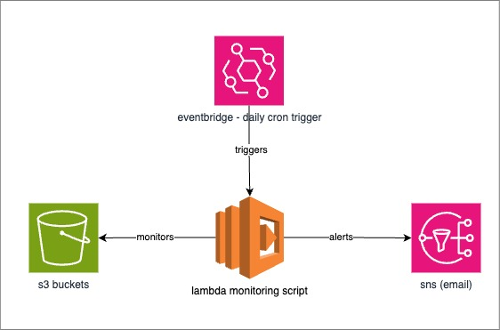

# AWS Lambda Backup Monitoring

This Lambda function monitors AWS S3 buckets for the presence of recent backup files and sends alerts via SNS if files are missing. 



---

## How It Works

#### Psuedoflow 
1. The function reads the monitoring rules from `config.json`.
2. For each S3 bucket and prefix:
   - Lists files in the prefix using `list_objects_v2`.
   - Checks if any file was uploaded within the last `timedelta_days` days.
3. If no recent file is found, it adds the bucket and prefix to an alert list.
4. Sends an SNS notification if alerts list is not empty.

#### Components used:
1. **AWS Lambda**: Serverless compute to run this script.
1. **AWS S3**: Target to be monitored.
2. **AWS SNS**: To send email for alerts.
3. **AWS EventBridge**: Used as daily trigger for the lambda function.

---

## Setup and Configuration

### SNS
- Create a topic (Standard)
- Create a subscription under the topic 
    - protocol: email
    - endpoint: enter the email address that you wish to receive alerts from

### Lambda  
- During initialization of lambda, add additional permissions by clicking `Change default execution role -> Create a new role from AWS policy templates`
- Select `Amazon S3 object read-only permissions` and `Amazon SNS publish policy`
- Once created, some modifications are required for the new role policy.

##### S3 Permission
Replace `globeoss-backup-sample` with actual bucket name.
```json
{
    "Version": "2012-10-17",
    "Statement": [
        {
            "Effect": "Allow",
            "Action": [
                "s3:GetObject",
                "s3:ListBucket"
            ],
            "Resource": [
                "arn:aws:s3:::globeoss-backup-sample",
                "arn:aws:s3:::globeoss-backup-sample/*"
            ]
        }
    ]
}
```

##### SNS Permission
Replace `your-arn` with your actual arn from SNS 
```json
{
    "Version": "2012-10-17",
    "Statement": [
        {
            "Sid": "VisualEditor0",
            "Effect": "Allow",
            "Action": "sns:Publish",
            "Resource": "<your-arn>"
        }
    ]
}
```

##### config.json
Create a `config.json` file in the "code" tab and paste contents in `config.json.example`, make necessary modifications:
- **bucket-name-1**: Name of the S3 bucket to monitor.
- **prefix**: Folder or file prefix to check in the bucket.
- **timedelta_days**: Number of days to look back for uploaded files.

##### lambda_function.py
Create a `lambda_function.py` file and paste the contents. 

##### Environment Variables
Set the required environment variables for the Lambda function:
- `TIMEZONE_OFFSET`: Offset from UTC in hours. Defaults to `0` (UTC).
- `SNS_TOPIC_ARN`: ARN of the SNS topic to send alerts.

### EventBridge
- In the lambda function created above, in "Function Overview", click add trigger
- In "Select a source", select "EventBridge"
- Click "Create New Rule"
- For "Rule type", select "Schedule expression"
- For "Schedule expression", enter your cron expression, for example `cron(0 22 * * ? *)`
> Note that eventbridge follows UTC time. Make necessary adjustments. 